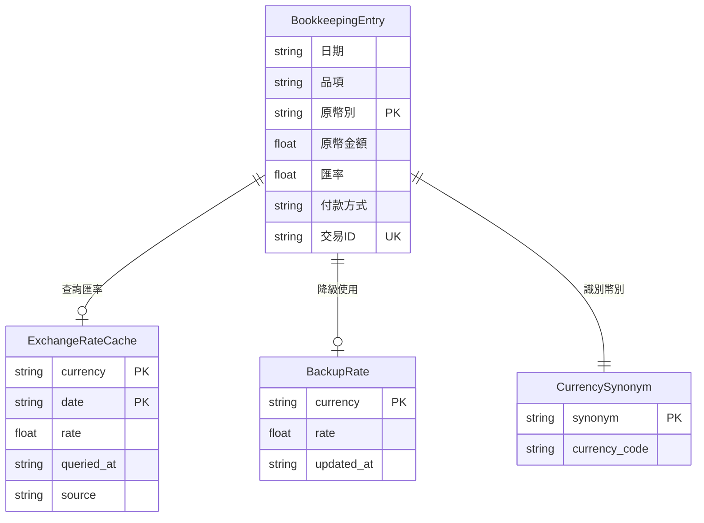
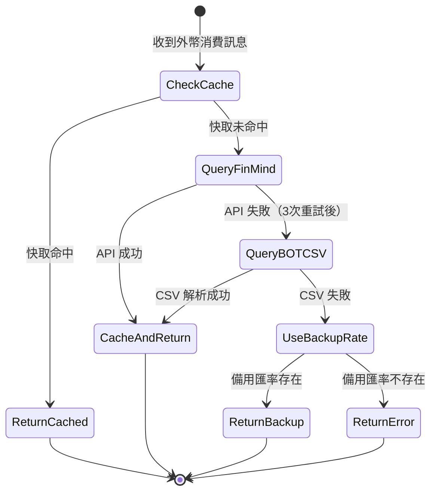

# Data Model: 多幣別記帳功能

**功能**：003-multi-currency
**建立日期**：2025-11-21
**相關文件**：[spec.md](./spec.md) | [plan.md](./plan.md) | [research.md](./research.md)

---

## 概述

本文件定義多幣別記帳功能的資料模型，包含實體定義、欄位說明、關係和驗證規則。

---

## 實體定義

### 1. 外幣消費記錄 (Foreign Currency Expense)

**描述**：代表一筆外幣消費記錄，繼承自現有的消費記錄結構，額外包含幣別、匯率等資訊。

**Python 資料類別**：`BookkeepingEntry`（擴充現有）

**欄位清單**：

| 欄位名稱 | 型別 | 必填 | 預設值 | 說明 | 驗證規則 |
| --- | --- | --- | --- | --- | --- |
| 日期 | str | ✅ | - | 記帳日期（YYYY-MM-DD） | 格式：YYYY-MM-DD |
| 時間 | str | ✅ | - | 記帳時間（HH:MM） | 格式：HH:MM |
| 品項 | str | ✅ | - | 消費項目名稱 | 非空字串 |
| **原幣別** | str | ✅ | `"TWD"` | **幣別代碼（ISO 4217）** | 必須為支援的幣別代碼 |
| 原幣金額 | float | ✅ | - | 原幣金額 | 必須 > 0 |
| **匯率** | float | ✅ | `1.0` | **查詢到的匯率（現金賣出價）** | 必須 > 0 |
| 付款方式 | str | ✅ | - | 付款方式（如「大戶」、「灰狗卡」） | 非空字串 |
| 交易ID | str | ✅ | - | 交易識別碼（YYYYMMDD-HHMMSS） | 格式：YYYYMMDD-HHMMSS |
| 明細說明 | str | - | `""` | 額外說明 | - |
| 分類 | str | ✅ | - | 消費分類 | 非空字串 |
| 專案 | str | - | `"日常"` | 專案名稱 | - |
| 必要性 | str | ✅ | - | 必要性等級 | 必須為枚舉值之一 |
| 代墊狀態 | str | - | `"無"` | 代墊狀態 | 必須為枚舉值之一 |
| 收款支付對象 | str | - | `""` | 收款或支付對象 | - |
| 附註 | str | - | `""` | 附註資訊 | - |

**新增欄位說明**：
- **原幣別**：幣別代碼，預設為 `"TWD"`（新台幣）。當為外幣消費時，設定為對應的 ISO 4217 代碼（如 `"USD"`、`"EUR"`）
- **匯率**：當日查詢到的匯率（現金賣出價）。新台幣消費時為 `1.0`，外幣消費時為實際匯率（如 USD 為 31.5）

**計算欄位**：
- **新台幣金額**：計算公式為 `原幣金額 × 匯率`，無需額外儲存（由 Make.com 在 Google Sheets 中計算）

**枚舉值**：

**必要性**：
- `"必要日常支出"`
- `"想吃想買但合理"`
- `"療癒性支出"`
- `"衝動購物（提醒）"`

**代墊狀態**：
- `"無"`（預設）
- `"代墊"`
- `"需支付"`
- `"不索取"`

**支援的幣別代碼**：
- `TWD`（新台幣，預設）
- `USD`（美元）
- `EUR`（歐元）
- `JPY`（日圓）
- `GBP`（英鎊）
- `AUD`（澳幣）
- `CAD`（加拿大幣）
- `CNY`（人民幣）

**範例資料**：

```json
{
  "日期": "2025-11-21",
  "時間": "14:30",
  "品項": "WSJ 訂閱",
  "原幣別": "USD",
  "原幣金額": 4.99,
  "匯率": 31.50,
  "付款方式": "大戶",
  "交易ID": "20251121-143052",
  "明細說明": "華爾街日報年度訂閱",
  "分類": "訂閱服務",
  "專案": "日常",
  "必要性": "想吃想買但合理",
  "代墊狀態": "無",
  "收款支付對象": "",
  "附註": ""
}
```

**計算結果**：
- 新台幣金額 = 4.99 × 31.50 = 157.19 元

---

### 2. 匯率快取 (Exchange Rate Cache)

**描述**：儲存從 FinMind API 或台灣銀行 CSV 取得的匯率資料，用於減少 API 呼叫次數並提升效能。

**儲存位置**：Vercel KV（Key-Value Store）

**Key 格式**：`exchange_rate:{currency}:{date}`
- 範例：`exchange_rate:USD:2025-11-21`

**Value 結構**（JSON）：

| 欄位名稱 | 型別 | 說明 |
| --- | --- | --- |
| currency | str | 幣別代碼（ISO 4217） |
| rate | float | 現金賣出價 |
| queried_at | str | 查詢時間戳（ISO 8601 格式） |
| source | str | 資料來源（`"finmind"` 或 `"bot_csv"` 或 `"backup"`） |

**TTL（Time-To-Live）**：3600 秒（1 小時）

**範例資料**：

```json
{
  "currency": "USD",
  "rate": 31.50,
  "queried_at": "2025-11-21T14:30:52+08:00",
  "source": "finmind"
}
```

---

### 3. 預存備用匯率 (Backup Exchange Rates)

**描述**：預先儲存常用幣別（USD、EUR、JPY）的備用匯率，當 API 查詢失敗時使用。

**儲存位置**：Vercel KV 或配置檔案

**Key 格式**：`backup_rate:{currency}`
- 範例：`backup_rate:USD`

**Value 結構**（JSON）：

| 欄位名稱 | 型別 | 說明 |
| --- | --- | --- |
| currency | str | 幣別代碼 |
| rate | float | 備用匯率 |
| updated_at | str | 更新時間戳 |

**更新頻率**：每週手動或自動更新

**範例資料**：

```json
{
  "currency": "USD",
  "rate": 31.50,
  "updated_at": "2025-11-21T00:00:00+08:00"
}
```

---

### 4. 幣別同義詞對照表 (Currency Synonym Mapping)

**描述**：將使用者輸入的幣別關鍵字（如「美金」、「歐元」）對應到標準 ISO 4217 代碼。

**儲存位置**：程式碼常數（`app/exchange_rate.py`）

**資料結構**：Python 字典

```python
CURRENCY_SYNONYMS = {
    # 美元
    "美元": "USD",
    "美金": "USD",
    "USD": "USD",
    "usd": "USD",

    # 歐元
    "歐元": "EUR",
    "EUR": "EUR",
    "eur": "EUR",
    "EU": "EUR",

    # 日圓
    "日圓": "JPY",
    "日幣": "JPY",
    "JPY": "JPY",
    "jpy": "JPY",

    # 英鎊
    "英鎊": "GBP",
    "GBP": "GBP",
    "gbp": "GBP",

    # 澳幣
    "澳幣": "AUD",
    "澳元": "AUD",
    "AUD": "AUD",
    "aud": "AUD",

    # 加幣
    "加幣": "CAD",
    "加拿大幣": "CAD",
    "CAD": "CAD",
    "cad": "CAD",

    # 人民幣
    "人民幣": "CNY",
    "CNY": "CNY",
    "cny": "CNY",
}
```

---

## 資料關係

### 關係圖（Mermaid）



### 關係說明

1. **BookkeepingEntry ↔ ExchangeRateCache**：
   - 當建立外幣消費記錄時，首先查詢 `ExchangeRateCache` 是否有快取
   - 若無快取，則呼叫 FinMind API 並儲存至快取

2. **BookkeepingEntry ↔ BackupRate**：
   - 當 FinMind API 和台灣銀行 CSV 皆失敗時，使用 `BackupRate` 的預存匯率

3. **BookkeepingEntry ↔ CurrencySynonym**：
   - GPT 解析使用者訊息時，使用 `CurrencySynonym` 將幣別關鍵字轉換為標準代碼

---

## 狀態轉換

### 匯率查詢狀態機



**狀態說明**：

1. **CheckCache**：檢查快取是否有效（未過期）
2. **QueryFinMind**：呼叫 FinMind API（最多重試 3 次）
3. **QueryBOTCSV**：降級至台灣銀行 CSV
4. **UseBackupRate**：使用預存的備用匯率（僅 USD、EUR、JPY）
5. **ReturnError**：回傳錯誤訊息給使用者

---

## 驗證規則

### 1. 幣別代碼驗證

**規則**：必須為支援的幣別代碼之一

**實作**：
```python
SUPPORTED_CURRENCIES = {"TWD", "USD", "EUR", "JPY", "GBP", "AUD", "CAD", "CNY"}

def validate_currency(currency: str) -> bool:
    return currency.upper() in SUPPORTED_CURRENCIES
```

**錯誤訊息**：
```
⚠️ 很抱歉，目前不支援 {currency} 幣別。支援的幣別：USD、EUR、JPY、GBP、AUD、CAD、CNY。
```

### 2. 匯率範圍驗證

**規則**：匯率必須大於 0，且在合理範圍內

**實作**：
```python
def validate_exchange_rate(rate: float, currency: str) -> bool:
    if rate <= 0:
        return False

    # 合理範圍檢查（避免 API 回傳異常值）
    REASONABLE_RANGES = {
        "USD": (25.0, 40.0),
        "EUR": (28.0, 45.0),
        "JPY": (0.15, 0.35),
        "GBP": (35.0, 50.0),
        "AUD": (18.0, 28.0),
        "CAD": (20.0, 30.0),
        "CNY": (3.5, 6.0),
    }

    if currency in REASONABLE_RANGES:
        min_rate, max_rate = REASONABLE_RANGES[currency]
        return min_rate <= rate <= max_rate

    return True  # 其他幣別不檢查範圍
```

**錯誤訊息**：
```
⚠️ 查詢到的匯率異常（{rate}），請稍後再試或聯絡系統管理員。
```

### 3. 金額驗證

**規則**：原幣金額必須大於 0

**實作**：
```python
def validate_amount(amount: float) -> bool:
    return amount > 0
```

**錯誤訊息**：
```
⚠️ 金額必須大於 0。
```

---

## Schema 定義（OpenAI Structured Output）

### 擴充現有 Schema

在 `app/schemas.py` 的 `MULTI_BOOKKEEPING_SCHEMA` 中新增欄位：

```python
MULTI_BOOKKEEPING_SCHEMA = {
    "name": "multi_bookkeeping_response",
    "strict": False,
    "schema": {
        "type": "object",
        "properties": {
            "intent": {
                "type": "string",
                "enum": ["multi_bookkeeping", "update_last_entry", "conversation", "error"],
                "description": "User intent type"
            },
            "payment_method": {
                "type": "string",
                "description": "Payment method (for multi_bookkeeping)"
            },
            "date": {
                "type": "string",
                "description": "Extracted date in MM/DD format or semantic date"
            },
            "items": {
                "type": "array",
                "description": "List of expense items (for multi_bookkeeping)",
                "items": {
                    "type": "object",
                    "properties": {
                        "品項": {
                            "type": "string",
                            "description": "Item name"
                        },
                        "原幣別": {  # 新增欄位
                            "type": "string",
                            "description": "Currency code (ISO 4217), default TWD",
                            "enum": ["TWD", "USD", "EUR", "JPY", "GBP", "AUD", "CAD", "CNY"]
                        },
                        "原幣金額": {
                            "type": "number",
                            "description": "Amount in original currency"
                        },
                        "明細說明": {
                            "type": "string",
                            "description": "Additional details"
                        },
                        "分類": {
                            "type": "string",
                            "description": "Category path"
                        },
                        "必要性": {
                            "type": "string",
                            "enum": ["必要日常支出", "想吃想買但合理", "療癒性支出", "衝動購物（提醒）"],
                            "description": "Necessity level"
                        },
                        "代墊狀態": {
                            "type": "string",
                            "enum": ["無", "代墊", "需支付", "不索取"],
                            "description": "Advance payment status"
                        },
                        "收款支付對象": {
                            "type": "string",
                            "description": "Person to receive or pay"
                        }
                    },
                    "required": ["品項", "原幣別", "原幣金額", "明細說明", "分類", "必要性", "代墊狀態", "收款支付對象"],
                    "additionalProperties": False
                }
            },
            # ... 其他欄位保持不變
        },
        "required": ["intent"]
    }
}
```

---

## 資料遷移

### 現有資料相容性

**問題**：現有的消費記錄沒有 `原幣別` 和 `匯率` 欄位。

**解決方案**：
1. 為現有欄位設定預設值：
   - `原幣別 = "TWD"`
   - `匯率 = 1.0`
2. 在 `BookkeepingEntry` 中設定預設值，確保向後相容

**實作**：
```python
@dataclass
class BookkeepingEntry:
    """記帳資料結構"""

    # ... 其他欄位
    原幣別: Optional[str] = "TWD"  # 預設為新台幣
    匯率: Optional[float] = 1.0      # 預設匯率為 1.0
```

**Make.com Webhook 相容性**：
- Make.com 會忽略未知欄位，因此新增 `原幣別` 和 `匯率` 不會影響現有流程
- 需在 Google Sheets 中新增對應欄位以儲存外幣資訊

---

## 效能考量

### 快取策略

1. **快取 Key 設計**：使用幣別和日期組合，確保同一天內相同幣別只查詢一次
2. **TTL 設定**：1 小時，平衡資料時效性和 API 呼叫次數
3. **快取預熱**：系統啟動時預載入 USD、EUR、JPY 當日匯率

### 批次查詢優化

**情境**：單一訊息包含多筆外幣消費（如「WSJ 4.99美元 大戶\nNetflix 10歐元 大戶」）

**策略**：
1. 收集所有需要查詢的幣別（去重）
2. 檢查快取
3. 批次呼叫 API（若支援）或序列呼叫
4. 統一儲存快取

**預期效果**：
- 減少 50% API 呼叫次數（假設 50% 命中快取）
- 處理時間從 10 秒降至 6 秒

---

## 總結

本資料模型設計遵循以下原則：

✅ **向後相容**：擴充現有 `BookkeepingEntry`，設定合理預設值
✅ **簡單明確**：欄位定義清晰，驗證規則明確
✅ **效能優化**：實作快取機制，減少 API 呼叫
✅ **錯誤處理**：多層降級機制，確保系統可靠性

下一步將建立 API 契約（contracts/）和快速入門文件（quickstart.md）。
