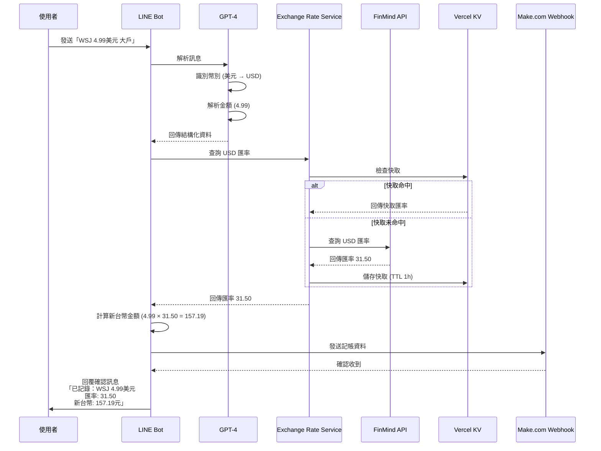

# Quick Start: 多幣別記帳功能開發指南

**功能**：003-multi-currency
**目標讀者**：開發者
**預計閱讀時間**：10 分鐘

---

## 概述

本指南協助開發者快速上手多幣別記帳功能的開發和測試。完成本指南後，您將能夠：

✅ 了解功能架構和資料流
✅ 設定本地開發環境
✅ 執行單元測試和整合測試
✅ 除錯和驗證功能

---

## 功能架構

### 資料流程圖



### 模組架構

```text
多幣別記帳功能
├── app/exchange_rate.py           # 匯率查詢服務 (新增)
│   ├── ExchangeRateService        # 主要服務類別
│   ├── get_rate()                 # 查詢匯率 (含降級機制)
│   ├── normalize_currency()       # 幣別同義詞轉換
│   └── convert_to_twd()           # 換算新台幣
│
├── app/gpt_processor.py           # GPT 訊息處理 (修改)
│   ├── BookkeepingEntry           # 新增 原幣別、匯率 欄位
│   └── process_multi_expense()    # 整合匯率查詢
│
├── app/schemas.py                 # Schema 定義 (修改)
│   └── MULTI_BOOKKEEPING_SCHEMA   # 新增 原幣別 欄位
│
├── app/prompts.py                 # GPT Prompt (修改)
│   └── MULTI_EXPENSE_PROMPT       # 新增幣別識別指令
│
└── app/webhook_sender.py          # Webhook 發送 (修改)
    └── send_to_webhook()          # 確保傳送外幣欄位
```

---

## 環境設定

### 1. 安裝依賴

本功能無需額外依賴，使用現有的 `requests` 套件。

```bash
# 使用 uv 同步依賴 (如果需要)
uv sync
```

### 2. 環境變數

無需新增環境變數。使用現有的 Vercel KV 配置。

**現有環境變數** (`.env`):
```bash
# LINE Bot
LINE_CHANNEL_SECRET=your_channel_secret
LINE_CHANNEL_ACCESS_TOKEN=your_access_token

# OpenAI
OPENAI_API_KEY=your_openai_api_key

# Webhook
WEBHOOK_URL=your_make_com_webhook_url

# Vercel KV (用於匯率快取)
KV_REST_API_URL=your_kv_url
KV_REST_API_TOKEN=your_kv_token
```

### 3. 本地測試環境

FinMind API 無需認證即可測試，直接呼叫即可。

```bash
# 測試 FinMind API 是否可用
curl "https://api.finmindtrade.com/api/v3/data?dataset=TaiwanExchangeRate&data_id=USD&date=2006-01-01"
```

**預期回應**：包含 USD 匯率資料的 JSON

---

## 開發流程

### Step 1: 建立匯率查詢服務

**檔案**：`app/exchange_rate.py`

**核心功能**：
1. 查詢匯率（FinMind API → BOT CSV → 備用匯率）
2. 幣別同義詞轉換
3. 匯率快取

**基本實作骨架**：

```python
# app/exchange_rate.py
import requests
import logging
from typing import Optional
from datetime import datetime
from app.services.kv_store import KVStore

logger = logging.getLogger(__name__)

class ExchangeRateService:
    """Exchange rate service with fallback mechanism"""

    FINMIND_API_URL = "https://api.finmindtrade.com/api/v3/data"
    CACHE_TTL = 3600  # 1 hour

    CURRENCY_SYNONYMS = {
        "美元": "USD", "美金": "USD", "USD": "USD",
        "歐元": "EUR", "EUR": "EUR", "EU": "EUR",
        "日圓": "JPY", "日幣": "JPY", "JPY": "JPY",
        # ... 其他幣別
    }

    BACKUP_RATES = {
        "USD": 31.50,
        "EUR": 33.20,
        "JPY": 0.21,
    }

    def __init__(self, kv_store: KVStore):
        self.cache = kv_store

    def normalize_currency(self, currency_text: str) -> Optional[str]:
        """Convert currency text to ISO 4217 code"""
        return self.CURRENCY_SYNONYMS.get(currency_text)

    def get_rate(self, currency: str) -> Optional[float]:
        """Get exchange rate with fallback mechanism"""
        # TODO: Implement
        pass

    def convert_to_twd(self, amount: float, currency: str) -> Optional[float]:
        """Convert foreign currency to TWD"""
        rate = self.get_rate(currency)
        if rate is None:
            return None
        return round(amount * rate, 2)
```

### Step 2: 擴充 GPT Processor

**檔案**：`app/gpt_processor.py`

**修改點**：
1. 在 `BookkeepingEntry` 新增 `原幣別` 和 `匯率` 欄位
2. 在 `process_multi_expense()` 中整合匯率查詢

**實作範例**：

```python
# app/gpt_processor.py
from app.services.exchange_rate import ExchangeRateService

@dataclass
class BookkeepingEntry:
    """記帳資料結構"""

    # ... 現有欄位
    原幣別: Optional[str] = "TWD"  # 新增
    匯率: Optional[float] = 1.0      # 新增

# 在 process_multi_expense() 中
def process_multi_expense(user_message: str, user_id: str) -> MultiExpenseResult:
    # ... 現有邏輯

    # 初始化匯率服務
    exchange_rate_service = ExchangeRateService(kv_store)

    # 為每個項目查詢匯率
    for entry in entries:
        if entry.原幣別 != "TWD":
            rate = exchange_rate_service.get_rate(entry.原幣別)
            if rate:
                entry.匯率 = rate
            else:
                # 處理匯率查詢失敗
                logger.error(f"Failed to get rate for {entry.原幣別}")
```

### Step 3: 更新 Schema

**檔案**：`app/schemas.py`

**修改點**：在 `MULTI_BOOKKEEPING_SCHEMA` 的 `items` 中新增 `原幣別` 欄位

```python
# app/schemas.py
"items": {
    "type": "array",
    "items": {
        "type": "object",
        "properties": {
            "品項": {...},
            "原幣別": {  # 新增
                "type": "string",
                "description": "Currency code (ISO 4217)",
                "enum": ["TWD", "USD", "EUR", "JPY", "GBP", "AUD", "CAD", "CNY"]
            },
            "原幣金額": {...},
            # ... 其他欄位
        },
        "required": ["品項", "原幣別", "原幣金額", ...]
    }
}
```

### Step 4: 更新 Prompt

**檔案**：`app/prompts.py`

**修改點**：在 `MULTI_EXPENSE_PROMPT` 中新增幣別識別指令

```python
# app/prompts.py
CURRENCY_DETECTION = """
## 幣別識別規則

當使用者訊息中包含幣別關鍵字時，設定 `原幣別` 為對應的 ISO 4217 代碼：

支援的幣別：
- 美元、美金、USD → "USD"
- 歐元、EUR → "EUR"
- 日圓、日幣、JPY → "JPY"
- 英鎊、GBP → "GBP"
- 澳幣、澳元、AUD → "AUD"
- 加幣、加拿大幣、CAD → "CAD"
- 人民幣、CNY → "CNY"

當無幣別關鍵字時，設定 `原幣別 = "TWD"`（新台幣）。

範例：
- "WSJ 4.99美元 大戶" → 原幣別: "USD", 原幣金額: 4.99
- "便當 80 現金" → 原幣別: "TWD", 原幣金額: 80
"""

MULTI_EXPENSE_PROMPT = f"""
{CURRENCY_DETECTION}

# 你的其他 prompt 內容...
"""
```

---

## 測試

### 單元測試

**檔案**：`tests/test_exchange_rate.py`

```bash
# 執行匯率服務單元測試
uv run pytest tests/test_exchange_rate.py -v
```

**測試案例**：
1. 幣別同義詞轉換
2. FinMind API 查詢
3. 快取機制
4. 降級至 CSV
5. 使用備用匯率

### 整合測試

**檔案**：`tests/test_multi_currency.py`

```bash
# 執行多幣別整合測試
uv run pytest tests/test_multi_currency.py -v
```

**測試案例**：
1. 單筆外幣消費記錄
2. 多筆外幣消費記錄
3. 混合新台幣和外幣消費
4. 匯率查詢失敗處理

### 本地手動測試

**使用 `test_local.py`**：

```python
# test_local.py (修改現有檔案)
from app.gpt_processor import process_multi_expense

# 測試外幣消費
user_message = "WSJ 4.99美元 大戶"
result = process_multi_expense(user_message, "test_user")

print(f"Intent: {result.intent}")
print(f"Entries: {result.entries}")
print(f"Currency: {result.entries[0].原幣別}")
print(f"Rate: {result.entries[0].匯率}")
```

```bash
# 執行本地測試
uv run python test_local.py
```

---

## 除錯

### 常見問題

**1. FinMind API 回傳空資料**

**症狀**：`data` 欄位為空陣列

**原因**：幣別代碼錯誤或不支援

**解決方案**：
- 檢查幣別代碼是否為 ISO 4217 標準（大寫）
- 確認幣別在支援清單中

**2. 匯率查詢超時**

**症狀**：`requests.Timeout` 異常

**原因**：網路連線問題或 API 回應慢

**解決方案**：
- 增加 timeout 值（目前 10 秒）
- 檢查網路連線
- 使用備用方案（CSV 或備用匯率）

**3. 快取未生效**

**症狀**：每次都呼叫 API

**原因**：KV Store 連線問題或 Key 格式錯誤

**解決方案**：
- 檢查 Vercel KV 環境變數
- 驗證 Key 格式：`exchange_rate:{currency}:{date}`
- 檢查 TTL 設定

### 日誌追蹤

**啟用詳細日誌**：

```python
# 在 app/exchange_rate.py 中
logger.setLevel(logging.DEBUG)

# 記錄關鍵步驟
logger.debug(f"Checking cache for {currency}")
logger.debug(f"Cache hit: {cached_rate}")
logger.debug(f"Calling FinMind API for {currency}")
logger.debug(f"Got rate: {rate}")
```

**查看日誌**：

```bash
# 本地開發
uv run python test_local.py 2>&1 | grep exchange

# Vercel 部署後
vercel logs
```

---

## 驗證清單

開發完成後，請確認以下項目：

### 功能驗證

- [ ] 識別外幣消費訊息（如「WSJ 4.99美元 大戶」）
- [ ] 正確轉換幣別同義詞（「美金」→「USD」）
- [ ] 成功查詢匯率（FinMind API）
- [ ] 匯率快取生效（同一幣別當天只查詢一次）
- [ ] 降級機制正常（API 失敗時切換至 CSV 或備用匯率）
- [ ] 正確計算新台幣金額（原幣金額 × 匯率）
- [ ] 回覆訊息包含匯率和新台幣金額
- [ ] 資料正確發送至 Make.com webhook

### 錯誤處理驗證

- [ ] 不支援的幣別回傳明確錯誤訊息
- [ ] API 失敗時回傳友善訊息
- [ ] 網路錯誤時回傳友善訊息
- [ ] 金額為 0 或負數時回傳錯誤

### 測試覆蓋率

- [ ] 單元測試通過（`test_exchange_rate.py`）
- [ ] 整合測試通過（`test_multi_currency.py`）
- [ ] 手動測試通過（`test_local.py`）

---

## 下一步

完成開發後：

1. **執行 `/speckit.tasks`**：生成實作任務清單
2. **執行 `/speckit.implement`**：開始逐步實作
3. **建立 Pull Request**：提交程式碼審查

---

## 參考資源

- [功能規格](./spec.md)
- [實作規劃](./plan.md)
- [研究報告](./research.md)
- [資料模型](./data-model.md)
- [FinMind API 契約](./contracts/finmind-api.md)
- [專案憲章](../../.specify/memory/constitution.md)

---

**版本**：1.0.0
**最後更新**：2025-11-21
